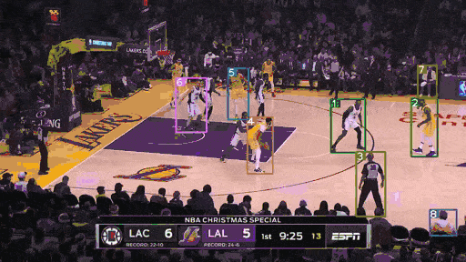

# App using YOLOv4 + DeepSORT for Youtube videos

A computer vision web-app that tracks people in youtube videos using neural networks and object tracking.

## How It Works

App streams video data directly from YouTube and outputs a live visualization that tracks people. The system works by fusing together a few computer vision techniques into a single pipeline.

1) Object Detection: When the first frame of the video is streamed in, a pre-trained neural network is used to locate and tag all people in the image. Although this uses a one-stage detector for real-time processing, the tracker is slower and not fit for real-time.

2) Object Tracking: Once people are detected, the data are passed to a tracking algorithm, which builds models of both the appearance and motion of the detected people and uses these models to follow them from frame to frame. Additionally, tracking exhibits lots of ID switching if done in a crowded scene.

These two stages interact dynamically to track as consistently as possible. If the camera shot changes, the system is forced to re-detect people.

## Dependencies

### Object detection and tracking

Detection is accomplished via a YOLO v4 implementation from [https://github.com/Tianxiaomo/pytorch-YOLOv4](https://github.com/Tianxiaomo/pytorch-YOLOv4). Tracking is accomplished using DeepSORT implementation from [https://github.com/ZQPei/deep_sort_pytorc](https://github.com/ZQPei/deep_sort_pytorch).

Yolo v4 weights
- yolov4.pth [(https://drive.google.com/open?id=1wv_LiFeCRYwtpkqREPeI13-gPELBDwuJ)](https://drive.google.com/open?id=1wv_LiFeCRYwtpkqREPeI13-gPELBDwuJ)

DeepSORT weights
- ckpt.t7 [(https://drive.google.com/drive/folders/1xhG0kRH1EX5B9_Iz8gQJb7UNnn_riXi6)](https://drive.google.com/drive/folders/1xhG0kRH1EX5B9_Iz8gQJb7UNnn_riXi6)

### Video Streaming

Streaming video from YouTube is accomplished using *pafy*. *Pafy* optionally depends on the *youtube-dl* package (Recommended).

### Deployment

App is built with *Flask*. *Flask* needs to be installed.

## License

This project is licensed under the MIT License - see the [LICENSE.md](LICENSE.md) file for details
